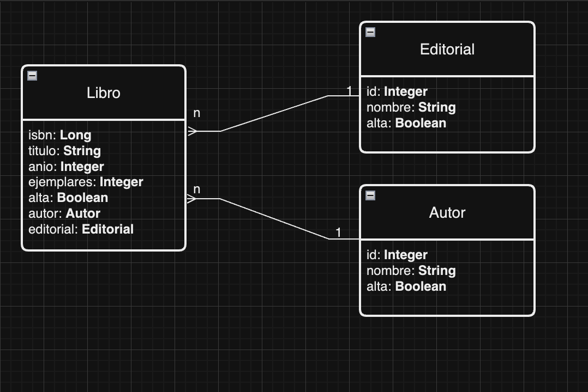

## JPA: Actividad integradora

### Actividad Sistema de Guardado de una Librería:

El objetivo de este ejercicio es el desarrollo de un sistema de guardado de libros en JAVA utilizando una base de datos MySQL, JPA como framework de persistencia y MAVEN para gestionar las dependencias.

* **Creación de la Base de Datos MySQL:** Lo primero que se debe hacer es crear la base de datos sobre la que operará el sistema de reservas de libros. Para ello, se debe abrir el IDE de base de datos que se está utilizando y ejecutar la siguiente sentencia:
    ~~~
    CREATE DATABASE libreria_jpa;
    ~~~
  _De esta manera se habrá creado una base de datos vacía llamada `libreria_jpa`._

* **Capas del Proyecto Java:** Las capas que se utilizarán para este proyecto son las siguientes: 
    * **entity:** En esta capa se almacenarán aquellas clases que se quiere persistir en la base de datos.
    * **persistence:** En esta capa se alojarán todas las clases DAO de cada una de tus entidades.
    * **service:** En esta capa se alojarán las clases encargadas de gestionar la lógica del negocio. Por lo general, se crea un servicio para manejar las operaciones CRUD (Crear, Leer, Actualizar, Eliminar) de cada entidad, así como también las consultas relacionadas con cada una de ellas.

---

> En este proyecto, trabajarás con la eliminación de entidades, aunque es importante destacar que eliminar registros directamente no siempre es una buena práctica. Para evitar la eliminación definitiva, implementarás un borrado lógico, permitiendo que las entidades puedan ser activadas o desactivadas en lugar de ser eliminadas de la base de datos.
>
>🔹 ¿Cómo lo harás? Cada entidad incluirá un atributo booleano llamado "activo", que estará configurado en true al momento de su creación. Cuando necesites "eliminar" una entidad, simplemente cambiarás su estado a false, evitando la pérdida definitiva de los datos y facilitando su posible reactivación en el futuro.
>
> Este enfoque mejora la integridad de la información y te permitirá tener un mejor control sobre los datos almacenados.

> 

---

* **Entidades:** Crearás el siguiente modelo de entidades: 

1. **Libro:** La entidad `libro` modela los libros que están disponibles en la biblioteca. En esta entidad, el atributo `ejemplares` contiene la cantidad total de ejemplares de ese libro, En esta versión BETA no gestionamos transacciones de préstamo. **El `isbn`, será la llave primaria de esa entidad.**

2. **Autor:** La entidad `autor` modela los autores de libros. El `id`, será la llave primaria de esa entidad, debe ser autogenerado.

3. **Editorial:** La entidad `editorial` modela las editoriales que publican libros.  El `id`, será la llave primaria de esa entidad, debe ser autogenerado.

---

* **Unidad de Persistencia:** Configurar tu archivo `persistence.xml` para indicar lo necesario para crear la unidad de persistencia y la conexión con la base de datos correspondiente.

* **Servicios:** Deberás contemplar los siguientes puntos:
    1. **AutorServicio:** Esta clase tiene la responsabilidad de llevar adelante las funcionalidades necesarias para administrar autores (consulta, creación, modificación y eliminación). Recomendamos gestionar un método para eliminar, y comprender su lógica de aplicación, y un método darBaja, para setear el atributo booleano. (qué es cómo se gestiona en el ámbito de desarrollo). 
    2. **EditorialServicio:** Esta clase tiene la responsabilidad de llevar adelante las funcionalidades necesarias para administrar editoriales (consulta, creación, modificación y baja).
    3. **LibroServicio:** Esta clase tiene la responsabilidad de llevar adelante las funcionalidades necesarias para administrar libros (consulta, creación, modificación y baja).

* **Main:** Esta clase tiene la responsabilidad de llevar adelante las funcionalidades necesarias para interactuar con el usuario. En esta clase se muestra el menú de opciones con las operaciones disponibles que podrá realizar el usuario. Si lo deseas puedes crear una clase independiente llamada Menu y desde el Main solamente invocar a la misma. 

---

###  **Tareas a realizar**

1. Crear la base de datos `libreria_jpa`.

2. Crear archivo de configuración correspondiente para declarar la unidad de persistencia y establecer la conexión con la base de datos. 

3. Crear entidades previamente mencionadas (`Libro`, `Autor`, `Editorial`).

4. Generar las tablas con JPA.

5. Crear los servicios correspondientes para manipular la lógica de cada entidad. 

6. Crear los métodos para persistir entidades en la base de datos librería.

7. Crear los métodos para dar de `alta/baja` o `editar` dichas entidades.

8. Búsqueda de un `Autor` por `nombre`.

9. Búsqueda de un `Libro` por `ISBN`.

10. Búsqueda de un `Libro` por `Título`. 

11. Búsqueda de un `Libro/s` por `nombre de Autor`.

12. Búsqueda de un `Libro/s` por `nombre de Editorial`.

13. Agregar las siguientes validaciones a todas las funcionalidades de la aplicación: 

    * Validar campos obligatorios.

    * No ingresar datos duplicados. 

---

© 2024 | Desarrollado por [Fernando Noguera](https://www.linkedin.com/in/jfnoguerab/)